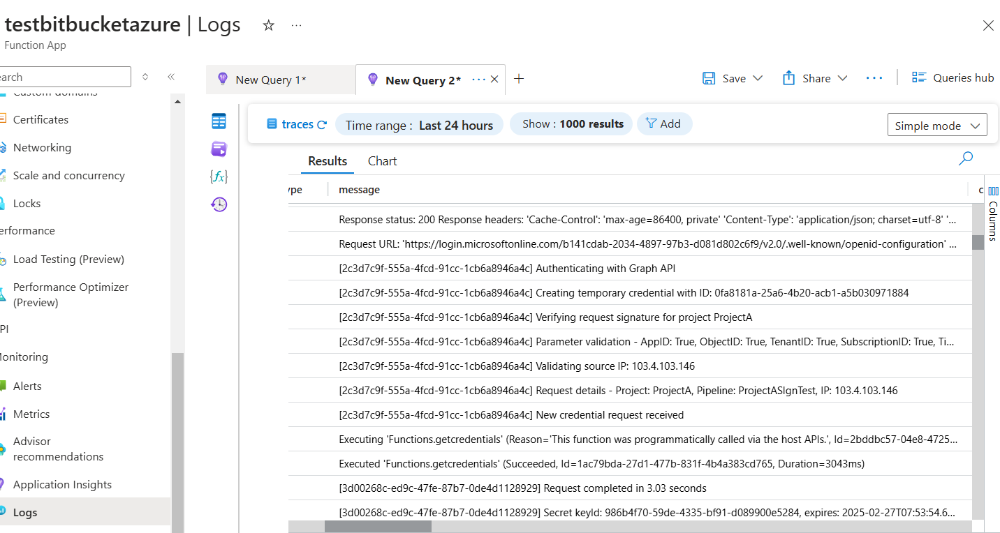

<h1 style="font-family: 'poppins'; font-weight: bold; color: Green;">👨‍💻Author: Muhammmad Ateeb Aslam (DevOps Engineer)</h1>

[](https://github.com/ateeb327)
[](https://www.linkedin.com/in/muhammad-ateeb-aslam/)
[](mailto:ateeb327@outlook.com)

---
# BitBridge
# Azure-Bitbucket Authentication Broker

A comprehensive guide for implementing secure authentication between Bitbucket Pipelines and Azure resources using an Azure Function as an authentication broker.

---

## Table of Contents

- [Introduction](#introduction)
- [Challenge Statement](#challenge-statement)
- [Solution Architecture](#solution-architecture)
- [Components Overview](#components-overview)
- [Authentication Flow](#authentication-flow)
- [Security Features](#security-features)
- [Implementation Guide](#implementation-guide)
  - [Prerequisites](#prerequisites)
  - [Step 1: Create Management App Registration](#step-1-create-management-app-registration)
  - [Step 2: Create Project-Specific App Registrations](#step-2-create-project-specific-app-registrations)
  - [Step 3: Deploy Azure Function](#step-3-deploy-azure-function)
  - [Step 4: Configure Bitbucket Pipeline](#step-4-configure-bitbucket-pipeline)
- [Testing the Implementation](#testing-the-implementation)
- [Troubleshooting](#troubleshooting)
- [Security Considerations](#security-considerations)
- [Maintenance Tasks](#maintenance-tasks)
- [Cost Considerations](#cost-considerations)

---

## Introduction

This solution provides a secure authentication mechanism for Bitbucket Pipelines to deploy infrastructure to Azure. Unlike GitHub Actions, Bitbucket Pipelines does not support Azure OIDC federation, necessitating an alternative approach to securely authenticate pipeline deployments without storing Azure credentials directly in Bitbucket repositories.

The solution implements an Azure Function as an authentication broker that generates temporary, scoped credentials on-demand, ensuring proper separation of concerns between different projects while maintaining a strong security posture.

Our Solution Function is inside "AzureFunction" folder inside this repository.

---

## Challenge Statement

Organizations face several security and operational challenges when integrating Bitbucket Pipelines with Azure:

- **Credential Exposure**: Storing Azure service principal credentials directly in Bitbucket repositories creates significant security risks
- **Management Overhead**: Creating and managing separate credentials for each project is time-consuming and error-prone
- **Secret Rotation**: Regular rotation of credentials requires manual updates across multiple repositories
- **Access Control**: Limited ability to enforce proper separation of concerns between projects
- **No OIDC Support**: Azure OIDC federation is not available for Bitbucket Pipelines (unlike GitHub Actions)
- **Audit Capabilities**: Difficult to track credential usage, including who is using credentials and when
- **Revocation Complexity**: Revoking access requires updating multiple repositories simultaneously

---

## Solution Architecture

The solution introduces an Azure Function as an authentication broker between Bitbucket Pipelines and Azure resources. This broker validates incoming requests from Bitbucket, generates temporary credentials with limited scope, and provides comprehensive audit logging.

### Architecture Diagram

![Architecture Diagram]
(./images/architecture-diagram.png)
*Architecture diagram showing the flow between Bitbucket, Azure Function, Management App, Project-Specific Apps, and Azure Resources*

### Workflow Overview


*Workflow diagram illustrating the step-by-step authentication and credential generation process*

---

## Components Overview

The architecture consists of four key components working together to provide secure authentication:

### 1. Management App (Azure AD Application)

- **Purpose**: Central identity for authentication and credential management
- **Permissions**: Limited to managing project-specific app credentials only
- **Restrictions**: Does NOT have direct resource modification permissions
- **Storage**: Credentials of this management app will be stored as environment variables in the Azure Function App
- **Role**: Acts as the owner of project-specific applications

### 2. Project-Specific Apps (Azure AD Applications)
 These are your service-principles.
- **Purpose**: Separate app registration per project with appropriate scoping
- **Permissions**: Limited to specific resource groups or subscriptions
- **Scope**: Each app handles deployments for its specific project only
- **Isolation**: Ensures proper separation of concerns between different projects

### 3. Azure Function App (Authentication Broker) - BitBridge

This is our BitBridge python function.
The central component that orchestrates the entire authentication process:

- **Request Validation**: Validates requests from Bitbucket pipelines using cryptographic signatures
- **Credential Generation**: Uses Management App identity to create temporary credentials in project-specific apps
- **Repository Validation**: Verifies Repository UUID to ensure only authorized repositories can request credentials
- **Audit Logging**: Implements comprehensive logging for compliance and security analysis
- **Time-Limited Access**: Generates credentials that expire after 1 hour (can be adjusted in BitBridge's Azure function code)

### 4. Bitbucket Pipelines

- **Lightweight Storage**: Stores only the FUNCTION_KEY and project metadata
- **No Direct Credentials**: No Azure service-principle credentials stored in Bitbucket repositories
- **Signed Requests**: Generates cryptographically signed requests to the Function App
- **Temporary Usage**: Uses returned temporary credentials returned by the function app for deployments

---

## Authentication Flow

The authentication flow follows a secure, multi-step process:

### Flow Diagram


*Authentication flow diagram showing the numbered steps from pipeline to Azure resources*

### Step-by-Step Process

#### 1. Initial Request from Bitbucket Pipeline

- Pipeline starts the deployment job
- Generates current timestamp
- Creates a request signature using FUNCTION_KEY and HMAC-SHA256
- Prepares request with:
  - Project ID
  - Repository UUID
  - App metadata (App ID, Object ID, Tenant ID, Subscription ID)
- Calls the Azure Function with signed request and headers

#### 2. Function App Authentication

- Receives request from Bitbucket pipeline
- Verifies request signature using FUNCTION_KEY
- Validates Repository UUID against allowed list
- Validates timestamp to prevent replay attacks (5-minute window)
- Rejects unauthorized or tampered requests

#### 3. Credential Generation

- Function App authenticates to Azure using Management App credentials
- Creates a temporary credential (client secret) in the project-specific app
- Credential has limited lifetime (1 hour)
- Returns credentials to Bitbucket pipeline in JSON format

#### 4. Infrastructure Deployment

- Pipeline receives temporary credentials
- Uses credentials for Azure authentication (via `az login`)
- Deploys infrastructure in Azure within scoped permissions
- Credentials automatically expire after 1 hour

This way temporary credentials will only be generated once the pipeline starts.

#### 5. Audit and Monitoring

- All requests logged in Function App with unique request IDs
- Credential creation recorded with:
  - Pipeline ID
  - Timestamp
  - Project information
  - Repository UUID
  - Request execution time
- Complete audit trail maintained for security analysis

---

## Security Features

The architecture implements multiple layers of security:

### 1. Request Signing

- **Algorithm**: HMAC-SHA256 signatures for all requests
- **Protection**: Prevents request tampering and unauthorized access
- **Replay Prevention**: Includes timestamp validation (5-minute window)
- **Integrity**: Ensures requests haven't been modified in transit

### 2. Repository UUID Validation

- **Authorization**: Ensures only authorized repositories can request credentials
- **Configuration**: Repository UUIDs configured as environment variables in Function App
- **Additional Layer**: Provides an extra authentication mechanism beyond signature verification

### 3. Temporary Credentials

- **Expiration**: All generated credentials expire after 1 hour
- **Risk Minimization**: Reduces risk window from exposed credentials
- **Per-Request**: Credentials created specifically for each pipeline run
- **Auto-Cleanup**: No manual revocation needed for expired credentials

### 4. Separation of Concerns

- **Project Isolation**: Each project uses its own app registration with appropriate permission scoping
- **Limited Management**: Management App only has permissions to manage credentials, not deploy resources
- **Scoped Permissions**: Project-specific apps have permissions limited to their respective resources
- **Least Privilege**: Each component has minimal required permissions

### 5. Comprehensive Logging

- **Request Tracking**: All authentication requests logged with unique request IDs
- **Audit Trail**: Captures project ID, pipeline ID, repository UUID, and timestamp
- **Security Analysis**: Complete audit trail for security investigation and compliance
- **Performance Metrics**: Execution time tracked for each request

---

## Implementation Guide

Follow these steps carefully to implement the authentication broker solution.

### Prerequisites

Before beginning implementation, ensure you have:

- **Azure Permissions**: Appropriate permissions to create App Registrations in Azure Entra ID
- **Function App Access**: Permission to create and configure Azure Function Apps
- **Bitbucket Access**: Administrative access to Bitbucket repository settings
- **Development Tools**:
  - Visual Studio Code
  - Azure Functions extension for VS Code
  - Python 3.9 or higher
  - Azure CLI (for testing)

---

### Step 1: Create Management App Registration

The Management App serves as the central identity for managing credentials.

#### 1.1 Create the App Registration

1. Log into **Azure Portal**
2. Navigate to **Azure Active Directory > App registrations**
3. Click **New registration**
4. Configure the registration:
   - **Name**: `ManagementApp`
   - **Supported account types**: Single tenant
   - **Redirect URI**: Leave blank
5. Click **Register**

#### 1.2 Record Essential Information

After creation, immediately note the following values (you'll need them later):

- **Application (client) ID**
- **Directory (tenant) ID**

#### 1.3 Create Client Secret

1. In the ManagementApp, navigate to **Certificates & Secrets**
2. Click **New client secret**
3. Provide a description (e.g., "ManagementApp Secret for Function")
4. Select an appropriate expiration period
5. Click **Add**
6. **IMPORTANT**: Copy the secret value immediately (it won't be visible again)
7. Store this secret securely

#### 1.4 Assign API Permissions

1. Navigate to **API Permissions**
2. Click **Add a permission**
3. Select **Microsoft Graph**
4. Choose **Application permissions**
5. Search for and add: `Application.ReadWrite.OwnedBy`
6. Click **Add permissions**
7. Click **Grant admin consent** (requires admin privileges)
8. Confirm the consent

> **Note**: The `Application.ReadWrite.OwnedBy` permission allows the ManagementApp to create and manage secrets only for applications it owns, providing the principle of least privilege.

---

### Step 2: Create Project-Specific App Registrations

Create a separate app registration for each project that requires Azure deployments.

> **Note**: You can skip steps 2.1 - 2.3 if you already have the app registrations that does the deployments. You can continue from Step 2.4

#### 2.1 Create Project App Registration

For each project (e.g., Project-A, Project-B):

1. Navigate to **Azure Active Directory > App registrations**
2. Click **New registration**
3. Configure the registration:
   - **Name**: `[Project-Name]-App` (e.g., `Project-A-App`)
   - **Supported account types**: Single tenant
   - **Redirect URI**: Leave blank
4. Click **Register**

#### 2.2 Record Application Information

After creation, note the following values for this project app:

- **Application (client) ID**
- **Object ID** (found in the Overview section)

#### 2.3 Assign RBAC Permissions

Grant the project app appropriate permissions to deploy resources:

1. Navigate to your **Azure subscription** (or specific resource group)
2. Go to **Access control (IAM)**
3. Click **Add role assignment**
4. Configure the assignment:
   - **Role**: `Contributor` (or a custom role with relevant permissions)
   - **Scope**: Resource group or subscription for the project
   - **Members**: Search for and select your project-specific app (e.g., `Project-A-App`)
5. Click **Review + assign**

> **Best Practice**: Scope permissions to the minimum resource group needed rather than entire subscription

#### 2.4 Make ManagementApp the Owner

This critical step grants ManagementApp the authority to create credentials for this project app.

##### Via Azure Portal:

1. Go to the **Project-specific App's** page
2. Navigate to **Owners** section
3. Click **Add owners**
4. Search for `ManagementApp`
5. Select it and click **Select**

> **Note**: By the team I am writing this, UI don't show apps in "Add Owners" Section. You need to follow the below cloud shell step for this.

##### Via Azure Cloud Shell:

1. Open **Azure Cloud Shell** (PowerShell or Bash)
2. Get the ManagementApp service principal Object ID:

```bash
az ad sp list --filter "displayName eq 'ManagementApp'" --query "[].id" -o tsv
```

> **Note**: This sp object ID is different from what you visually saw listed as ObjectID on App registration's Overview page.

3. Add ManagementApp as owner (replace IDs with your values):

```bash
az ad app owner add --id <PROJECT_APP_OBJECT_ID> --owner-object-id <MANAGEMENT_APP_SP_OBJECT_ID>
```

> **Note**: Use management App's SP Object ID you got from the command above and Project App's regular Object ID you normally saw via UI on Project App registartion's Overview page.

#### 2.5 Repeat for Each Project

Repeat steps 2.1 through 2.4 for each additional project requiring Azure deployments.

---

### Step 3: Deploy Azure Function

The Azure Function acts as the authentication broker.

#### 3.1 Create Function App in Azure

1. In **Azure Portal**, navigate to **Create a resource**
2. Search for **Function App** and select it
3. Click **Create**
4. Configure the Function App:
   - **Subscription**: Select your subscription
   - **Resource Group**: Create new or use existing
   - **Function App name**: Choose a unique name (e.g., `bitbucket-auth-broker`)
   - **Runtime stack**: Python
   - **Version**: 3.9 or higher
   - **Region**: Select appropriate region
   - **Hosting Plan**: Consumption (Serverless)
5. Click **Review + create**, then **Create**
6. Enable **Application Insights** for monitoring (recommended)

#### 3.2 Prepare Development Environment

##### Install Required Tools:

1. Install **Visual Studio Code**
2. Install **Azure Functions extension** for VS Code
3. Sign in to Azure account within VS Code

##### Create Function Project:

1. Open VS Code
2. Open **Command Palette** (Ctrl+Shift+P or Cmd+Shift+P)
3. Type and select: `Azure Functions: Create New Function`
4. Select a folder for your project
5. Choose **Python** as the language
6. Select Python interpreter (3.9+)
7. Choose **HTTP trigger** as the template
8. Name the function: `function_app`
9. Choose **Function** as the authorization level

This generates the following structure:

```
project-folder/
├── function_app.py
├── requirements.txt
├── host.json
├── local.settings.json
└── .vscode/
```

#### 3.3 Prepare Function Code Files

##### Update `requirements.txt`:

Replace the contents with:

```
azure-functions
azure-keyvault-secrets
azure-identity
requests
```

##### Update `function_app.py`:

Replace the contents with the provided Python code inside `AzureFunction` folder for the authentication broker. The code includes:

- **SecurityValidator class**: Handles signature verification and repository UUID validation
- **getcredentials function**: Main HTTP trigger function that processes credential requests
- **Comprehensive logging**: Tracks all requests with unique IDs
- **Error handling**: Graceful error responses with detailed logging

> **Note**: The complete Python code is provided  in the `function_app.py` file inside AzureFunction folder.

#### 3.4 Deploy Function to Azure

1. In VS Code, open **Command Palette** (Ctrl+Shift+P or Cmd+Shift+P)
2. Type and select: `Azure Functions: Deploy to Function App`
3. Select your Azure subscription
4. Select the Function App you created earlier
5. Confirm deployment
6. Wait for deployment to complete

#### 3.5 Configure Environment Variables

After deployment, configure the Function App with required environment variables:

1. In **Azure Portal**, navigate to your Function App
2. Go to **Environment Variables** under Settings
3. Add **Environment Variables** like below:

| Variable Name | Value | Description |
|--------------|-------|-------------|
| `FUNCTION_KEY` | `<master-key>` | Get from Function App > App keys > _master |
| `GRAPH_CLIENT_ID` | `<management-app-id>` | Application ID of ManagementApp |
| `GRAPH_CLIENT_SECRET` | `<management-secret>` | Client secret of ManagementApp |
| `GRAPH_TENANT_ID` | `<tenant-id>` | Your Azure AD Tenant ID |
| `ALLOWED_REPO_UUIDS` | `[uuid1,uuid2]` | Comma-separated list of allowed Bitbucket repository UUIDs (No space after commas) |

4. Click **Save** after adding all variables
5. Restart the Function App if necessary

##### Getting the FUNCTION_KEY:

1. In your Function App, navigate to **App keys** (under Functions section)
2. Under **Host keys**, find `_master`
3. Click **Show value** and copy it
4. Use this value for the `FUNCTION_KEY` environment variable

---

### Step 4: Configure Bitbucket Pipeline

Configure your Bitbucket repository to use the authentication broker.

#### 4.1 Find Repository UUID

1. Go to your **Bitbucket repository**
2. Navigate to **Repository settings**
3. Go to **OIDC** settings
4. Copy the **Repository UUID** (format: `{xxxxxxxx-xxxx-xxxx-xxxx-xxxxxxxxxxxx}`)

> **Important**: Add this UUID to the `ALLOWED_REPO_UUIDS` environment variable in your Function App

#### 4.2 Add Repository Variables

1. In your Bitbucket repository, navigate to **Repository settings**
2. Go to **Repository variables** (under Pipelines section)
3. Add the following variables:

| Variable Name | Value | Secured? | Description |
|--------------|-------|----------|-------------|
| `FUNCTION_KEY` | `<function-key>` | ✓ Yes | The _master key from Azure Function |
| `FUNCTION_URL` | `<function-url>` | No | Full URL of your Azure Function |
| `APP_ID` | `<project-app-id>` | No | Application ID of project-specific app |
| `OBJECT_ID` | `<project-app-object-id>` | No | Object ID of project-specific app |
| `TENANT_ID` | `<tenant-id>` | No | Azure AD Tenant ID |
| `SUBSCRIPTION_ID` | `<subscription-id>` | No | Azure Subscription ID for deployments |
| `PROJECT_NAME` | `<project-identifier>` | No | Unique identifier for this project |

> **Important**: Now you can see that only secret we need to save in Bitbucket variables is the FUNCTION_KEY. We don't need to save any ClientSecret

**Example FUNCTION_URL**: `https://bitbucket-auth-broker.azurewebsites.net/api/getcredentials`

#### 4.3 Create Pipeline Configuration

Create a `bitbucket-pipelines.yml` file in your repository root with the following structure:

```yaml
image: atlassian/default-image:3

pipelines:
  branches:
    main:
      - step:
          name: Azure Authentication and Deployment
          script:
            # Generate timestamp and signature
            - export TIMESTAMP=$(date +%s)
            - export MESSAGE="${PROJECT_NAME}:${TIMESTAMP}"
            - export SIGNATURE=$(echo -n "$MESSAGE" | openssl dgst -sha256 -hmac "${FUNCTION_KEY}" | cut -d " " -f 2)
            - export COMBINED_NAME="${PROJECT_NAME}-${BITBUCKET_BUILD_NUMBER}"

            # Call Azure Function to get credentials
            - export CREDS=$(curl "${FUNCTION_URL}?appId=${APP_ID}&objectId=${OBJECT_ID}&tenantId=${TENANT_ID}&subscriptionId=${SUBSCRIPTION_ID}&project=${PROJECT_NAME}&code=${FUNCTION_KEY}" \
                -H "x-request-timestamp: ${TIMESTAMP}" \
                -H "x-request-signature: ${SIGNATURE}" \
                -H "x-pipeline-id: ${COMBINED_NAME}" \
                -H "x-repository-uuid: ${BITBUCKET_REPO_UUID}")

            # Parse and use credentials
            - export AZURE_CLIENT_SECRET=$(echo "$CREDS" | jq -r '.clientSecret' | tr -d '\r' | tr -d '\n')

            # Install Azure CLI
            - curl -sL https://aka.ms/InstallAzureCLIDeb | bash

            # Login to Azure
            - az login --service-principal -u ${APP_ID} -p ${AZURE_CLIENT_SECRET} --tenant ${TENANT_ID}

            # Your deployment commands here
            # e.g., terraform apply, az deployment group create, etc.
```

> **Note**: The complete pipeline YAML with detailed logging and error handling is provided separately.

#### 4.4 Commit and Push

1. Add the `bitbucket-pipelines.yml` file to your repository
2. Commit the changes
3. Push to the `main` branch (or configured branch)
4. The pipeline should trigger automatically

---

## Testing the Implementation

Follow these steps to verify your implementation is working correctly.

### 1. Trigger Pipeline Execution

1. Commit and push changes to your Bitbucket repository
2. Navigate to **Pipelines** in Bitbucket
3. Monitor the pipeline execution in real-time

### 2. Verify Function App Logs

1. In Azure Portal, navigate to your Function App
2. Go to **Application Insights** (or Log stream)
3. Verify the following in logs:
   - ✓ Request signature is validated successfully
   - ✓ Repository UUID is validated against allowed list
   - ✓ Temporary credential is created with correct expiration
   - ✓ Request completed successfully with execution time

### 3. Check Pipeline Success

1. Verify pipeline completes without errors
2. Check that Azure login succeeds
3. Confirm deployment steps execute successfully

### 4. Verify Credential Creation in Azure

1. Navigate to **Azure Active Directory > App registrations**
2. Open your project-specific app
3. Go to **Certificates & secrets**
4. Verify a new client secret was created:
   - Name format: `pipeline-{BUILD_NUMBER}-{TIMESTAMP}`
   - Expiration: 1 hour from creation time
5. This secret should expire automatically after 1 hour

### 5. Test Security Features

#### Test Invalid Signature:

- Modify `FUNCTION_KEY` in Bitbucket to an incorrect value
- Run pipeline and verify it fails with "Invalid request signature" error

#### Test Unauthorized Repository:

- Remove your repository UUID from `ALLOWED_REPO_UUIDS` in Function App
- Run pipeline and verify it fails with "Unauthorized repository" error

#### Test Expired Timestamp:

- Manually set an old timestamp (>5 minutes)
- Verify request is rejected

---

## Troubleshooting

### Common Issues

#### 1. Invalid Signature Error

**Symptoms**: Pipeline fails with "Invalid request signature" error

**Solutions**:
- Verify `FUNCTION_KEY` matches exactly in both Function App and Bitbucket
- Ensure timestamp generation is working correctly
- Confirm signature calculation uses correct algorithm (HMAC-SHA256)
- Check that request is made within 5 minutes of timestamp generation
- Verify no extra whitespace in `FUNCTION_KEY` variable

#### 2. Repository UUID Validation Failure

**Symptoms**: Pipeline fails with "Unauthorized repository" error

**Solutions**:
- Verify repository UUID is correctly added to `ALLOWED_REPO_UUIDS` in Function App
- Ensure UUID includes curly braces: `{xxxxxxxx-xxxx-xxxx-xxxx-xxxxxxxxxxxx}`
- Check that Bitbucket is sending the correct repository UUID (`${BITBUCKET_REPO_UUID}`)
- Verify no extra spaces in comma-separated UUID list
- Restart Function App after updating environment variables

#### 3. Graph API Permission Errors

**Symptoms**: Function returns "Failed to create secret" or 403 errors

**Solutions**:
- Ensure ManagementApp has `Application.ReadWrite.OwnedBy` permission in Microsoft Graph
- Verify ManagementApp is the owner of the project-specific app
- Confirm admin consent was granted for the permission
- Check that `GRAPH_CLIENT_ID`, `GRAPH_CLIENT_SECRET`, and `GRAPH_TENANT_ID` are correctly set
- Verify the client secret for ManagementApp hasn't expired

#### 4. Missing Required Parameters

**Symptoms**: "Missing required parameters" error in pipeline

**Solutions**:
- Verify all required variables are set in Bitbucket repository variables
- Check curl command includes all necessary parameters
- Ensure all headers are properly formatted
- Verify parameter names match exactly (case-sensitive)

#### 5. Credential Expiration Issues

**Symptoms**: Credentials expire before deployment completes

**Solutions**:
- Optimize pipeline to complete within 1 hour
- Check deployment time and consider breaking into smaller steps
- Verify credentials are being used immediately after generation

### Debugging Steps

#### Enable Detailed Logging:

1. In Function App, ensure Application Insights is enabled
2. Set log level to "Information" or "Debug"
3. Monitor Live Metrics in Application Insights

#### Review Function Logs:

1. Navigate to **Function App > Log stream**
2. Look for request IDs in logs
3. Track the complete request flow
4. Check for any exception stack traces

#### Test Function Directly:

Use a tool like Postman or curl to test the Function directly:

```bash
curl "https://your-function.azurewebsites.net/api/getcredentials?appId=xxx&objectId=xxx&tenantId=xxx&subscriptionId=xxx&project=test&code=xxx" \
  -H "x-request-timestamp: $(date +%s)" \
  -H "x-request-signature: xxx" \
  -H "x-pipeline-id: test-123" \
  -H "x-repository-uuid: {your-uuid}"
```

#### Verify Environment Variables:

1. In Function App, go to **Configuration**
2. Verify all required environment variables are set
3. Check for any typos or incorrect values
4. Restart Function App after changes

---

## Security Considerations

### 1. FUNCTION_KEY Protection

- **Treat as Sensitive**: The FUNCTION_KEY is equivalent to a password
- **Secure Storage**: Use Bitbucket's secured variables (check "Secured" option)
- **Access Control**: Limit access to repository variables to administrators only
- **Regular Rotation**: Rotate the key periodically (e.g., every 90 days)
- **Rotation Process**:
  1. Generate new key in Function App
  2. Update Bitbucket variable
  3. Delete old key after verification

### 2. Repository UUID Validation

- **Maintain Accuracy**: Keep `ALLOWED_REPO_UUIDS` list up to date
- **Add/Remove Promptly**: Update list when repositories are added or deprecated
- **Additional Validation**: Consider implementing IP whitelisting if needed
- **Regular Audits**: Review allowed repositories quarterly

### 3. Request Signing

- **Replay Attack Prevention**: 5-minute timestamp validation window prevents replay attacks
- **Clock Synchronization**: Ensure system clocks are reasonably synchronized
- **Signature Strength**: HMAC-SHA256 provides strong cryptographic protection
- **Consider Enhancement**: If needed, implement additional entropy in signature

### 4. Permissions Management

- **Least Privilege Principle**: Grant minimum necessary permissions to project-specific apps
- **Regular Reviews**: Audit permissions quarterly
- **Resource Isolation**: Implement proper resource group separation between projects
- **RBAC Best Practices**:
  - Use custom roles when possible
  - Avoid subscription-level permissions
  - Document all permission grants

### 5. Credential Rotation

- **Management App Credentials**:
  - Rotate client secret every 90-180 days
  - Update Function App environment variables immediately
  - Test thoroughly after rotation
- **Monitoring**:
  - Set up alerts for authentication failures
  - Monitor for suspicious activity patterns
  - Implement automated alerting for credential expiration

### 6. Network Security

- **Function App Access**:
  - Consider implementing IP restrictions if feasible
  - Use Azure Private Endpoints for enhanced security
  - Enable HTTPS only
- **CORS Configuration**: Restrict CORS to necessary origins

### 7. Secrets Management

- **Azure Key Vault Integration**: Consider storing Management App credentials in Key Vault
- **No Hardcoding**: Never hardcode credentials in pipeline files
- **Git Secrets Scanning**: Implement pre-commit hooks to prevent credential commits

---

#### Management App Client Secret Rotation:

**Frequency**: Every 180 days (or per policy)

**Process**:
1. Create new client secret in ManagementApp
2. Update `GRAPH_CLIENT_SECRET` in Function App
3. Test credential generation
4. Monitor for any failures
5. Delete old secret after verification period
6. Update documentation


### 3. Monitoring and Alerting

**Set up alerts for**:
- Authentication failures (threshold: >5 failures in 10 minutes)
- Function App errors or exceptions
- Unusual credential request patterns
- Function App performance degradation
- Application Insights quota warnings

**Configure monitoring**:
- Enable Application Insights
- Set up custom dashboards
- Implement log retention policies (30-90 days minimum)
- Create security-focused workbooks

### 4. Repository Management

**Activities**:
- Keep `ALLOWED_REPO_UUIDS` current
- Remove deprecated repositories from allowed list
- Document procedures for adding new repositories
- Maintain inventory of all integrated repositories
- Regular cleanup of unused credentials in project apps

### 5. Documentation Updates

**Keep updated**:
- List of all project-specific apps and their scopes
- Repository UUID mappings
- Credential rotation history
- Incident response procedures
- Architecture diagrams

### 6. Backup and Disaster Recovery

**Regular backups of**:
- Function App code (maintain in source control)
- Environment variable configurations
- App registration metadata
- Pipeline configurations

**Recovery procedures**:
- Document steps to redeploy Function App
- Maintain backup credentials
- Test recovery process annually

---

## Cost Considerations

This solution is designed to be cost-effective for typical usage patterns.

### 1. Azure Function App

**Pricing Model**: Consumption Plan (Pay-per-execution)

**Free Tier**:
- First 1 million executions per month are FREE
- First 400,000 GB-s of resource consumption are FREE

**Typical Usage**:
- Average deployment frequency: 10-50 per day per repository
- Monthly executions: ~300-1,500 per repository
- **Expected Cost**: $0 (within free tier for most use cases)

**Calculation Example**:
- 50 pipelines/day × 30 days = 1,500 executions/month
- Well within 1 million free executions

### 2. Application Insights

**Free Tier**:
- First 5 GB of data ingestion per month is FREE

**Typical Usage**:
- Log data per request: ~5-10 KB
- Monthly data: 1,500 executions × 10 KB = ~15 MB
- **Expected Cost**: $0 (within free tier)

**Additional Costs** (if exceeded):
- Data ingestion: $2.30 per GB
- Data retention (beyond 90 days): $0.10 per GB/month

### 3. Azure Active Directory

**App Registrations**: FREE
- No cost for creating or maintaining app registrations
- No cost for standard Azure AD features
- Enterprise features (Conditional Access, etc.) may require Azure AD Premium

### 4. Network Egress

**Outbound Data**: Usually negligible
- Small JSON responses (~1-2 KB per request)
- Monthly data: ~1.5-3 MB
- First 100 GB per month are FREE
- **Expected Cost**: $0

### 5. Total Estimated Cost

**Monthly Cost Estimate**:
- Function App: $0 (free tier)
- Application Insights: $0 (free tier)
- Azure AD: $0 (free)
- Network: $0 (free tier)
- **Total: $0/month for typical usage**

**Scaling Considerations**:
- Costs remain minimal even with 10-20 repositories
- Breaking free tier threshold would require >33,000 executions/day
- Monitor usage via Azure Cost Management

### 6. Cost Optimization Tips

- Use Consumption plan (not Premium or Dedicated)
- Configure appropriate log retention policies
- Monitor usage with Azure Cost Management
- Set up budget alerts if needed
- Review Application Insights data retention settings

---
## Additional Images and Screenshots


## Conclusion

This authentication broker solution provides a secure, scalable, and cost-effective way to integrate Bitbucket Pipelines with Azure deployments. By following this guide, you can implement a robust authentication mechanism that:

- ✓ Eliminates credential storage in Bitbucket repositories
- ✓ Provides temporary, scoped credentials with automatic expiration
- ✓ Implements comprehensive security controls and audit logging
- ✓ Maintains proper separation of concerns between projects
- ✓ Operates at zero or minimal cost for typical usage

For questions, issues, or improvements, please feeel free to contribute by raising PR's or consult with me at:

LinkedIn: https://www.linkedin.com/in/muhammad-ateeb-aslam/
Email: ateeb327@outlook.com
